<p align="center">
  
</p>

---

## 🧠 Sobre Mim

Desenvolvedor Back-End apaixonado por tecnologia e pela arte de construir software de alta qualidade. Minha missão é traduzir requisitos complexos em sistemas performáticos, escaláveis e fáceis de manter.

Para isso, meu foco está em:

* **Arquitetura de Software:** Utilização de `Arquitetura Limpa`, `SOLID` e `DDD` para criar sistemas desacoplados, testáveis e que evoluem com o negócio.
* **Qualidade e Testes:** Aplicação de `TDD` para garantir um código robusto, com alta cobertura de testes e design emergente.
* **Automação e DevOps:** Construção de pipelines de `CI/CD` para automatizar a integração e a entrega, trazendo agilidade e segurança ao processo.

> "Transformar desafios técnicos em soluções limpas e elegantes é minha paixão."

---

## 📚 Formação Acadêmica

<div align="center">
  <a href="https://www.linkedin.com/in/lucascandidoluiz/" title="Ver detalhes da Graduação"></a> <a href="https://www.linkedin.com/in/lucascandidoluiz/" title="Ver detalhes da Pós-graduação"></a>
</div>

---

## 🧰 Tecnologias & Ferramentas

<div align="center">
  
| Categoria | Tecnologias |
| :---: | :--- |
| **Linguagens de Programação** |  |
| **Frameworks & Runtimes** |  |
| **Bancos de Dados** |  |
| **DevOps & Ferramentas** |  |

</div>

---

## 📊 GitHub Insights


---

## 📂 Linha do Tempo

```mermaid
gantt
    title Linha do Tempo Educacional
    dateFormat  YYYY-MM-DD
    axisFormat  %Y-%m

    section Formação
    Análise e Desenv. de Sistemas :done, 2021-01-01, 2023-12-01
    Pós-graduação em Eng. de Software :active, 2025-01-01, 2026-12-01
```



---

## 🧹 Stack YAML

```yaml
backend:
  linguagens:
    - Java
    - Python
    - JavaScript
    - C
    - C++
    - C#
  frameworks:
    - Spring Boot
    - Node.js
  bancos:
    - MySQL
    - SQLite
  praticas:
    - Clean Code
    - TDD
    - DDD
    - CI/CD
```

---

## 📢 Contato

<div align="center">
  <a href="https://www.linkedin.com/in/lucascandidoluiz/" target="_blank"></a> <a href="https://linktr.ee/boltreskh" target="_blank"></a>
</div>

---

<p align="center">
  <strong>"Código limpo não é um objetivo, é um estilo de vida."</strong>
</p>
